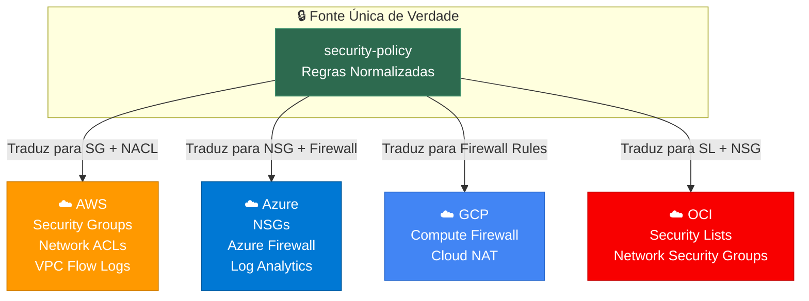
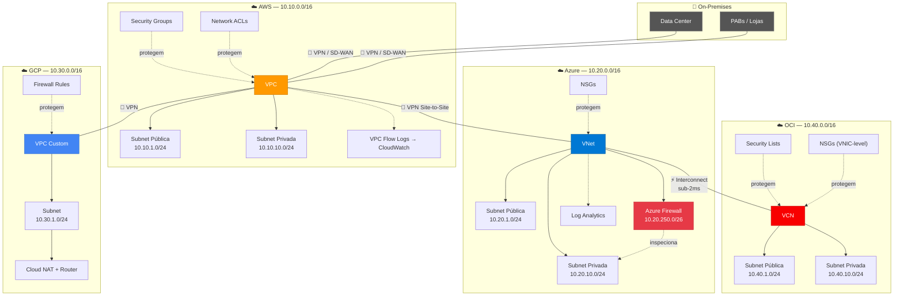
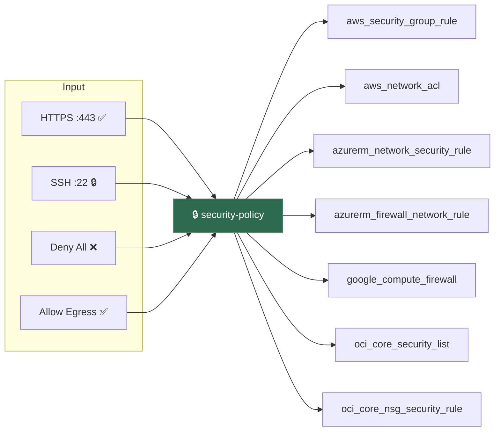
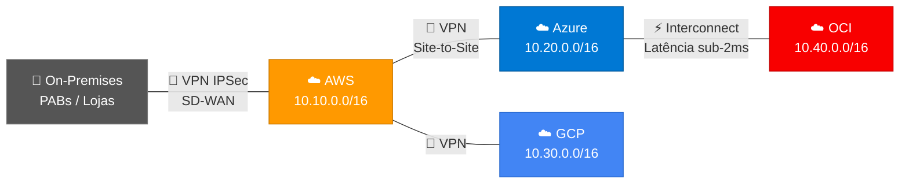
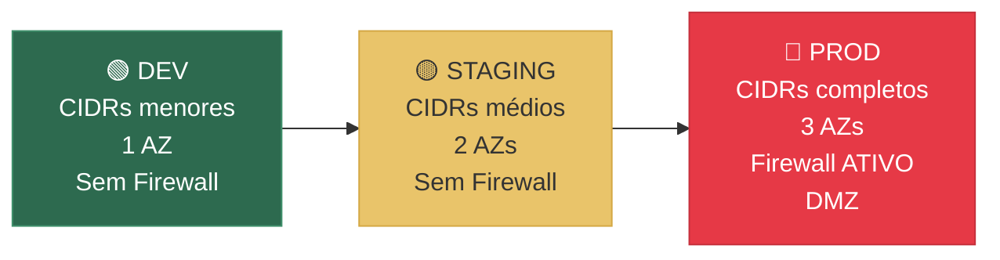

# 🛡️ Multi-Cloud Network Security — Infrastructure as Code

<div align="center">


**Projeto Terraform modular que padroniza e automatiza a segurança de rede em 4 clouds com políticas unificadas.**

> *"Se você não consegue destruir sua rede inteira e reconstruí-la em 10 minutos via Terraform com todas as regras de segurança aplicadas, você ainda tem um perímetro legado."*

</div>

---

## 📋 Índice

- [O Problema](#-o-problema)
- [A Solução](#-a-solução)
- [Arquitetura](#-arquitetura)
- [Estrutura do Projeto](#-estrutura-do-projeto)
- [Início Rápido](#-início-rápido)
- [Módulos](#-módulos)
- [Regras de Segurança](#-regras-de-segurança)
- [Conectividade](#-conectividade)
- [Monitoramento](#-monitoramento-e-logging)
- [Ambientes](#-ambientes)
- [Contribuindo](#-contribuindo)
- [Referências](#-referências)

---

## 🔥 O Problema

Empresas que operam em ambientes **híbridos e multi-cloud** enfrentam diariamente:

| Desafio | Impacto |
|---|---|
| 🔓 Regras de segurança inconsistentes entre clouds | Brechas de segurança não detectadas |
| ⏱️ Impossibilidade de reproduzir infra rapidamente | Disaster Recovery lento (horas/dias) |
| 👀 Falta de visibilidade centralizada | Shadow IT e compliance gaps |
| ✋ Configurações manuais | Erros humanos, drift de configuração |
| 📊 4 dashboards diferentes para 4 clouds | Complexidade operacional insustentável |

---

## ✅ A Solução

Uma **fonte única de verdade** para regras de segurança, implementada como Infrastructure as Code:



**Resultado:** Altere uma regra no `security-policy` → ela se propaga automaticamente para AWS, Azure, GCP e OCI.

---

## 🏗️ Arquitetura

### Visão Geral da Infraestrutura



### Fluxo de Tradução de Regras



---

## 📁 Estrutura do Projeto

```
📦 multicloud-security/
├── 📄 main.tf                    # Composição de todos os módulos
├── 📄 providers.tf               # Declaração dos 4 providers
├── 📄 variables.tf               # Variáveis globais (CIDRs, regiões, tags)
├── 📄 outputs.tf                 # IDs de rede de cada cloud
├── 📄 backend.tf                 # Config do state remoto (S3/Blob/GCS)
├── 📄 terraform.tfvars.example   # Template de configuração
├── 📄 .gitignore                 # Protege state e credenciais
│
├── 📂 modules/
│   ├── 📂 security-policy/       # 🔒 Regras normalizadas (FONTE ÚNICA)
│   │   └── main.tf               #    Baseline + regras por ambiente
│   │
│   ├── 📂 aws/                   # ☁️ Amazon Web Services
│   │   ├── main.tf               #    VPC, Subnets, SGs, NACLs, Flow Logs
│   │   ├── variables.tf
│   │   └── outputs.tf
│   │
│   ├── 📂 azure/                 # ☁️ Microsoft Azure
│   │   ├── main.tf               #    VNet, NSGs, Firewall, UDRs, Logs
│   │   ├── variables.tf
│   │   └── outputs.tf
│   │
│   ├── 📂 gcp/                   # ☁️ Google Cloud Platform
│   │   ├── main.tf               #    VPC, Firewall Rules, Cloud NAT
│   │   ├── variables.tf
│   │   └── outputs.tf
│   │
│   ├── 📂 oci/                   # ☁️ Oracle Cloud Infrastructure
│   │   ├── main.tf               #    VCN, Security Lists, NSGs, Gateways
│   │   ├── variables.tf
│   │   └── outputs.tf
│   │
│   └── 📂 connectivity/          # 🔗 VPN, Peering, Interconnect
│       └── main.tf               #    AWS↔Azure, AWS↔On-prem
│
├── 📂 environments/
│   ├── 📂 dev/                   # 🟢 Desenvolvimento
│   │   └── main.tf
│   ├── 📂 staging/               # 🟡 Staging
│   │   └── main.tf
│   └── 📂 prod/                  # 🔴 Produção (Firewall habilitado)
│       └── main.tf
│
└── 📂 docs/                      # 📖 Documentação adicional
    ├── ARCHITECTURE.md            #    Detalhes da arquitetura
    ├── MODULES.md                 #    Referência dos módulos
    ├── SECURITY.md                #    Políticas e compliance
    └── RUNBOOK.md                 #    Procedimentos operacionais
```

---

## 🚀 Início Rápido

### Pré-requisitos

| Ferramenta | Versão | Instalação |
|---|---|---|
| Terraform | >= 1.5.0 | [Download](https://developer.hashicorp.com/terraform/install) |
| AWS CLI | >= 2.0 | `aws configure` |
| Azure CLI | >= 2.0 | `az login` |
| gcloud CLI | latest | `gcloud auth application-default login` |
| OCI CLI | latest | `~/.oci/config` |

### 1. Clonar e Configurar

```bash
git clone https://github.com/SEU_USUARIO/multicloud-network-security.git
cd multicloud-network-security

# Copiar e preencher variáveis
cp terraform.tfvars.example terraform.tfvars
# ⚠️ Editar com seus valores reais (credenciais, CIDRs, etc.)
```

### 2. Inicializar e Validar

```bash
# Inicializar providers e módulos
terraform init

# Validar sintaxe e referências
terraform validate

# Verificar formatação
terraform fmt -check -recursive
```

### 3. Planejar e Aplicar

```bash
# Ver o plano completo (dry-run)
terraform plan -out=tfplan

# Aplicar as mudanças
terraform apply tfplan
```

### 4. Deploy por Ambiente

```bash
# Exemplo: deploy em desenvolvimento
cd environments/dev
terraform init
terraform plan
terraform apply
```

### 5. O Teste Definitivo ⚡

```bash
# Destruir TUDO
terraform destroy -auto-approve

# Reconstruir do ZERO — todas as regras reaplicadas automaticamente
terraform apply -auto-approve

# Tempo esperado: < 10 minutos 🎯
```

---

## 📦 Módulos

### `security-policy` — Fonte Única de Verdade

O coração do projeto. Define regras em formato agnóstico que cada provider consome:

```hcl
# Exemplo de regra normalizada
{
  name        = "allow-https"
  port        = 443
  protocol    = "tcp"
  cidr_blocks = ["0.0.0.0/0"]
  description = "Permitir HTTPS"
}
```

**Comportamento por ambiente:**
- **prod**: Apenas HTTPS e SSH restrito
- **dev/staging**: Adiciona HTTP interno (porta 80)

📖 [Documentação detalhada dos módulos →](docs/MODULES.md)

---

## 🔒 Regras de Segurança

### Baseline (todas as clouds)

| Regra | Porta | Protocolo | Direção | Ambiente | CIDR |
|---|---|---|---|---|---|
| ✅ HTTPS | 443 | TCP | Ingress | Todos | `0.0.0.0/0` |
| 🔒 SSH restrito | 22 | TCP | Ingress | Todos | `10.0.0.0/8` |
| 🌐 HTTP interno | 80 | TCP | Ingress | dev/staging | `10.0.0.0/8` |
| ❌ Deny All | * | * | Ingress | Todos | `0.0.0.0/0` |
| ✅ Allow All | * | * | Egress | Todos | `0.0.0.0/0` |

### Adicionar Regras Customizadas

```hcl
# No terraform.tfvars
additional_ingress_rules = [
  {
    name        = "allow-rdp"
    port        = 3389
    protocol    = "tcp"
    cidr_blocks = ["10.0.0.0/8"]
    description = "RDP para redes internas"
  },
  {
    name        = "allow-k8s-api"
    port        = 6443
    protocol    = "tcp"
    cidr_blocks = ["10.0.0.0/8"]
    description = "Kubernetes API Server"
  }
]
```

📖 [Política de segurança completa →](docs/SECURITY.md)

---

## 🌐 Conectividade



| Conexão | Tipo | Criptografia | Latência |
|---|---|---|---|
| AWS ↔ Azure | VPN Site-to-Site (IPSec) | AES-256 | ~15ms |
| Azure ↔ OCI | Interconnect Direto | Nativo | **< 2ms** |
| AWS ↔ On-prem | VPN + SD-WAN | AES-256 | Variável |
| GCP ↔ Hub | Cloud VPN | AES-256 | ~10ms |

Habilite via variáveis:

```hcl
enable_aws_azure_vpn = true
enable_onprem_vpn    = true
```

---

## 📊 Monitoramento e Logging

Cada cloud envia logs de tráfego para seu serviço nativo:

| Cloud | Recurso Monitorado | Destino | Retenção |
|---|---|---|---|
| AWS | VPC Flow Logs | CloudWatch Logs | 30 dias |
| Azure | NSG Diagnostics | Log Analytics Workspace | 30 dias |
| GCP | Subnet Flow Logs | Cloud Logging | Padrão GCP |
| OCI | VCN Flow Logs | OCI Logging | Padrão OCI |

---

## 🌍 Ambientes



| Característica | Dev | Staging | Prod |
|---|---|---|---|
| Availability Zones | 1 | 2 | 3 |
| Azure Firewall | ❌ | ❌ | ✅ |
| HTTP (porta 80) | ✅ | ✅ | ❌ |
| Subnet DMZ | ❌ | ❌ | ✅ |
| CIDR /24 Subnets | 1 pub + 1 priv | 2 pub + 2 priv | 3 pub + 3 priv |

---

## 🏷️ Tags / Labels

Todos os recursos são tagueados automaticamente para governança:

```hcl
{
  Project     = "multicloud-security"
  Environment = "dev" | "staging" | "prod"
  ManagedBy   = "terraform"
  Owner       = "platform-team"
}
```

---

## ⚠️ Notas Importantes

> **🔑 State Remoto:** Configure o `backend.tf` antes de usar em produção. O state contém dados sensíveis.

> **🔐 Credenciais:** **NUNCA** comite `terraform.tfvars` no Git. Ele está no `.gitignore`.

> **💰 Azure Firewall:** Habilitado automaticamente em `prod`. Custo: ~$1.25/hora (~$900/mês).

> **🔒 SSH:** Por padrão restrito a `10.0.0.0/8`. Ajuste `allowed_ssh_cidrs` conforme sua rede.

---

## 🤝 Contribuindo

1. Fork o repositório
2. Crie uma branch: `git checkout -b feature/nova-regra`
3. Faça suas alterações
4. Valide: `terraform fmt && terraform validate`
5. Abra um Pull Request

---

## 📖 Referências

| Recurso | Link |
|---|---|
| Terraform Multi-Cloud | [HashiCorp Tutorials](https://developer.hashicorp.com/terraform/tutorials) |
| Azure Hub-Spoke | [Microsoft Reference Architecture](https://learn.microsoft.com/azure/architecture/reference-architectures/hybrid-networking/hub-spoke) |
| AWS VPC Security | [AWS Best Practices](https://docs.aws.amazon.com/vpc/latest/userguide/security.html) |
| GCP Firewall | [Cloud Firewall Docs](https://cloud.google.com/vpc/docs/firewalls) |
| OCI Networking | [Oracle Docs](https://docs.oracle.com/iaas/Content/Network/Concepts/overview.htm) |

---

## 📜 Licença

MIT License — veja [LICENSE](LICENSE) para detalhes.

---

<div align="center">

**Feito com 🛡️ e Terraform**

*Segurança na nuvem é Infraestrutura como Código.*

</div>
