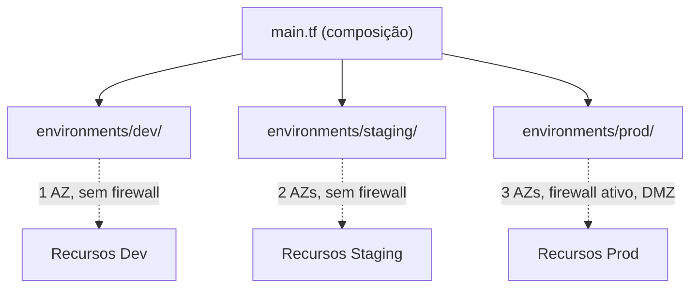
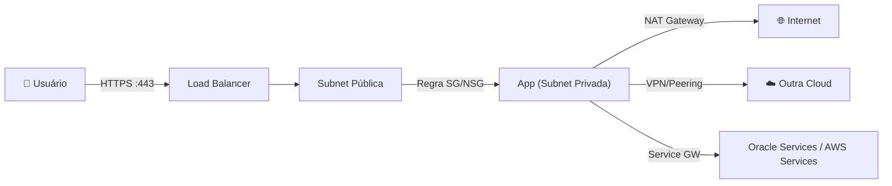

# 🏗️ Arquitetura — Multi-Cloud Network Security

## Visão Geral

Este projeto segue o padrão **Hub-Spoke** adaptado para multi-cloud, onde o módulo `security-policy` atua como hub lógico de governança e cada módulo de provider implementa um spoke com rede segura.

## Princípios de Design

### 1. Fonte Única de Verdade (Single Source of Truth)

```
security-policy/main.tf
└── Define regras normalizadas (port, protocol, cidr_blocks)
    ├── aws/main.tf       → Traduz para aws_security_group_rule
    ├── azure/main.tf     → Traduz para azurerm_network_security_rule
    ├── gcp/main.tf       → Traduz para google_compute_firewall
    └── oci/main.tf       → Traduz para oci_core_nsg_security_rule
```

### 2. Defesa em Profundidade (Defense in Depth)

Cada cloud implementa **múltiplas camadas** de proteção:

| Camada | AWS | Azure | GCP | OCI |
|---|---|---|---|---|
| **Perímetro** | VPC + IGW | VNet | VPC Custom | VCN + Gateways |
| **Firewall** | NACLs | Azure Firewall | Firewall Rules | Security Lists |
| **Micro-seg.** | Security Groups | NSGs | Target Tags | NSGs (VNIC) |
| **Roteamento** | Route Tables | UDRs | Cloud Router | Route Tables |
| **Logging** | Flow Logs → CW | Diagnostics → LAW | Flow Logs → CL | Flow Logs → OCI |

### 3. Imutabilidade

A infraestrutura é **descartável e reproduzível**:

```bash
terraform destroy && terraform apply  # Reconstrução completa em < 10 min
```

### 4. Separação de Ambientes



## Mapa de CIDRs

| Cloud | CIDR | Subnet Pública | Subnet Privada |
|---|---|---|---|
| AWS | `10.10.0.0/16` | `10.10.1-3.0/24` | `10.10.10-12.0/24` |
| Azure | `10.20.0.0/16` | `10.20.1.0/24` | `10.20.10.0/24` |
| GCP | `10.30.0.0/16` | `10.30.1.0/24` | — |
| OCI | `10.40.0.0/16` | `10.40.1.0/24` | `10.40.10.0/24` |

> ⚠️ Os CIDRs **não se sobrepõem** entre clouds, permitindo conectividade direta via VPN/Peering.

## Fluxo de Tráfego



## Decisões Técnicas

| Decisão | Justificativa |
|---|---|
| Terraform (não Pulumi/CDK) | Multi-cloud nativo, maior ecossistema de providers |
| Módulos locais (não registry) | Controle total, customização por necessidade |
| NACLs + SGs na AWS | Defesa em profundidade (stateless + stateful) |
| NSGs VNIC-level no OCI | Micro-segmentação superior às Security Lists |
| Azure Firewall condicional | Custo elevado (~$900/mês), necessário apenas em prod |
| Flow Logs em todas as clouds | Compliance e auditoria de tráfego |
| Cloud NAT no GCP | VMs sem IP público mantêm acesso à internet |
